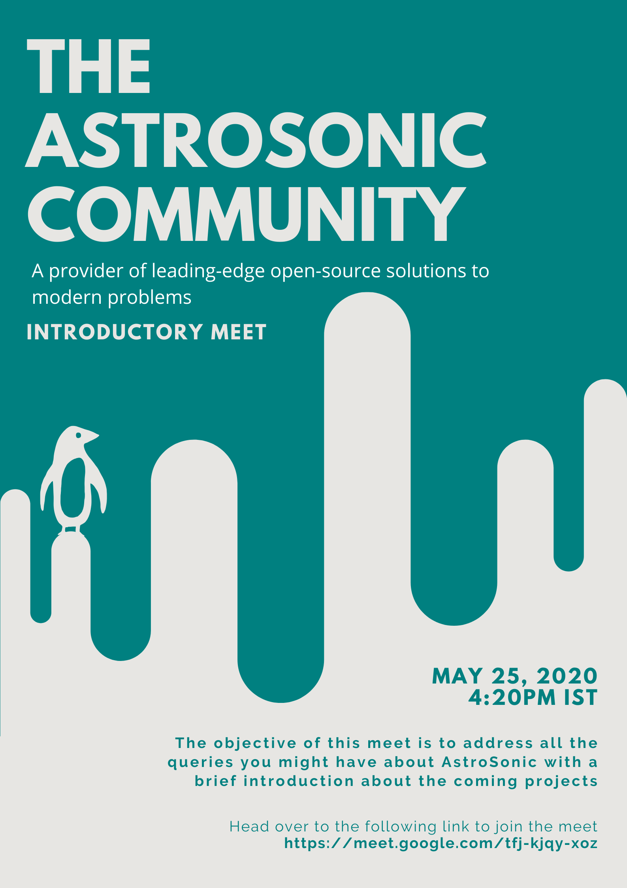
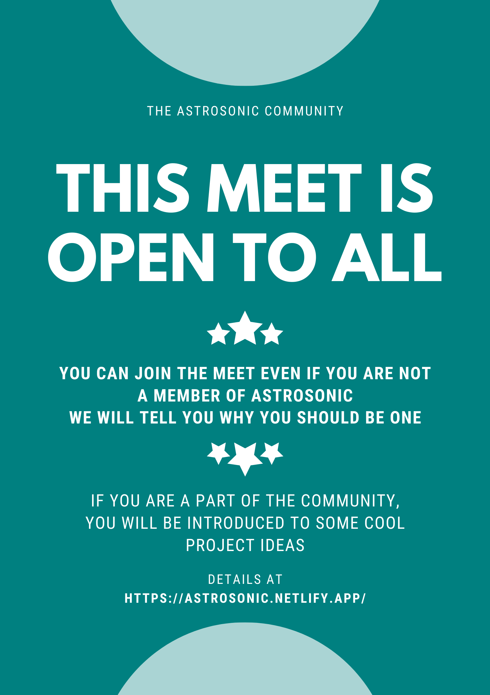

# What events are ongoing?

!!! warning "Things rapidly change around this page"
    As events come and go, they get listed here as **ONCOMING** and **PRECEDENT** events. You would want to come here often to check on the events that our community has been up to.

## Oncoming events

## Precedent events

### 25th May 2020
We had an open meet on 25th May 2020 at 4:20PM IST. There were about 21 participants in total in the meet. 

* We gave an introduction and and told why open-source is something to be considered while making projects.
* Members were told about the existing projects of AstroSonic and how they can get started with contributing.
* We discussed about how the community projects operate and addressed queries about it from all the members.
* We talked about the projects in progress and the ideas for impending projects.
* There were at least 5-6 new members during the meeting who looked inclined to join the community.

!!! tip "Join the meeting via the link provided below"
    The meeting took place from 4:20PM IST to 5:00PM IST on 25th May 2020.

!!! note "Invitation"
    

!!! note "Notice"
    

!!! tip "The posters are available for download"
    * Click [here](pdfs/25May2020-Meet-1.pdf) to download the invitation poster for the meeting.
    * Click [here](pdfs/25May2020-Meet-2.pdf) to download the notice poster for the meeting.

### 24th May 2020
We opened up the registration on 24th May 2020. at 6:19PM IST to everyone. There is no limit as to who can join the community and everyone with big dreams and will to build good projects is more than welcome here.

!!! tip "The registration form is out now!"
    Visit [this link](https://forms.gle/i3FM5LyUVwC1jPwQ7) to fill in your details and join the community if you have not already!